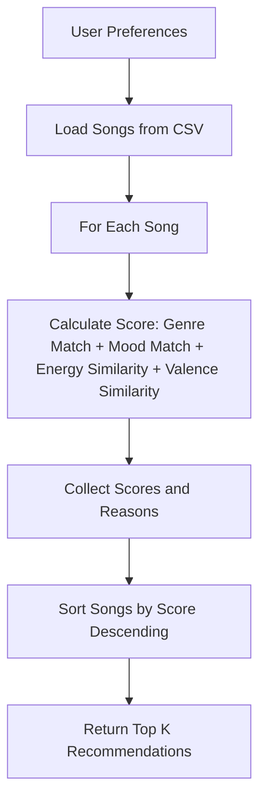

# 🎵 Music Recommender Simulation

## Project Summary

This project implements a simple music recommender system simulation using content-based filtering. It loads a dataset of 20 songs from a CSV file, scores each song based on user preferences for genre, mood, and energy level, and ranks the top recommendations with explanations. The system demonstrates how real-world recommenders work by matching song attributes to user tastes, providing a CLI interface for testing different profiles.

---

## How The System Works

Real-world music recommendation systems, like those used by Spotify or YouTube, typically combine collaborative filtering (analyzing patterns from other users' listening behavior, such as likes, skips, and playlists) with content-based filtering (using song attributes like tempo, mood, energy, and valence to match user preferences). My simplified version prioritizes content-based filtering, focusing on song features to create personalized recommendations without relying on user interaction data.

The Song objects use features: genre, mood, energy, valence, tempo_bpm, danceability, acousticness.

The UserProfile stores target values for: favorite_genre, favorite_mood, target_energy, target_valence.

The Recommender computes a score by awarding points for matches: +2.0 for genre match, +1.0 for mood match, and similarity scores for numerical features (e.g., energy closeness rewards songs closer to the user's target). Songs are ranked by total score, with the top recommendations selected.

Data Flow Diagram:


---

## Getting Started

### Setup

1. Create a virtual environment (optional but recommended):

   ```bash
   python -m venv .venv
   source .venv/bin/activate      # Mac or Linux
   .venv\Scripts\activate         # Windows

2. Install dependencies

```bash
pip install -r requirements.txt
```

3. Run the app:

```bash
python -m src.main
```

### Running Tests

Run the starter tests with:

```bash
pytest
```

You can add more tests in `tests/test_recommender.py`.

---

## Experiments You Tried

- When I reduced the genre weight from 2.0 to 1.0 and increased energy weight from 1.0 to 2.0, the rankings shifted to prioritize energy closeness over genre matches. For example, in the High-Energy Pop profile, Storm Runner (rock, intense, energy 0.91) ranked higher than Sunrise City (pop, happy, energy 0.82) because its energy was closer to 0.9.
- Tested with three diverse profiles: High-Energy Pop, Chill Lofi, and Deep Intense Rock. The system correctly recommended low-energy songs for Chill Lofi and high-energy ones for the others, showing sensitivity to preferences.

---

## Limitations and Risks

- The system uses a small dataset of only 20 songs, limiting variety and potentially leading to repetitive recommendations.
- It relies solely on content-based filtering, ignoring collaborative data like user listening history, which could miss serendipitous discoveries.
- Over-prioritization of certain features (e.g., energy) can bias results, favoring songs that match one attribute while ignoring others like mood or genre.
- No consideration for lyrics, artist popularity, or cultural context, which are important in real music recommendations.

---

## Reflection

Read and complete `model_card.md`:

[**Model Card**](model_card.md)

I learned that recommenders turn data into predictions by defining scoring rules that quantify similarity between user preferences and item attributes, then ranking items by score. Simple algorithms like weighted matching can be effective for content-based systems, but they require careful tuning to avoid biases, such as overemphasizing one feature.

Bias or unfairness could show up in systems like this through dataset limitations (e.g., underrepresentation of certain genres) or scoring imbalances that favor mainstream preferences. In real-world applications, this could lead to filter bubbles where users only see similar content, reducing exposure to diverse music and potentially reinforcing stereotypes.

